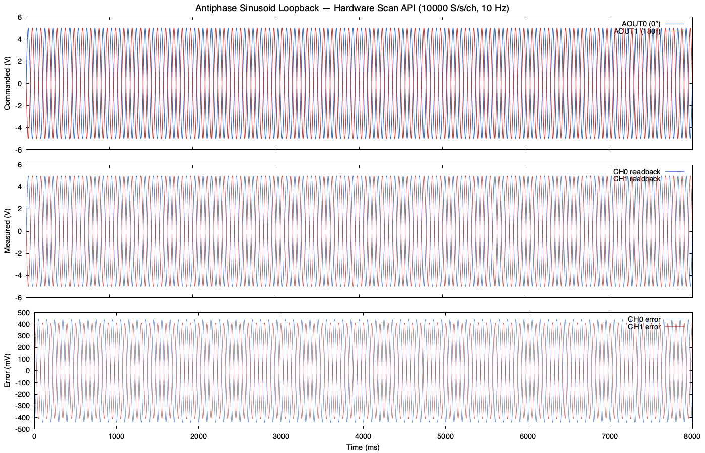

# Brock treadmill DAQ
Code for reading/writing from the DAQ. 

Runnable files:
- sinusoid_loopback (C++)
- ```uv run sinusoid``` (Py)

# Todos
1. testing on windows.
2. Gui using imgui for linux/windows treadmill control. 
3. bullet-proofing design for VFD interaction.

# Python quick start (any OS, I believe, but need to test)
Using UV for dependency management, install via
```uv sync```
and run with 
```uv run sinusoid```


# C++ quick start (linux)
run the ```install.txt``` commands to install the ULDAQ drivers. 

build with
```g++ -std=c++17 -O2 -o sinusoid_loopback sinusoid_loopback.cpp -luldaq -lm```

run with 
```./sinusoid_loopback```


